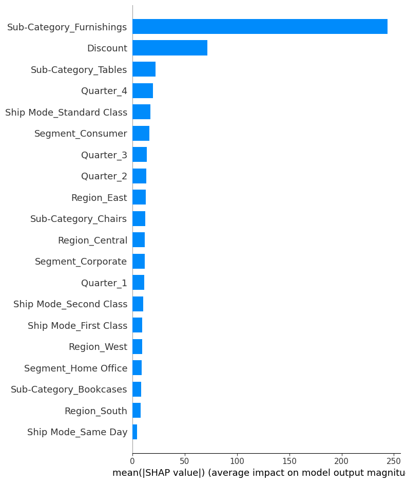
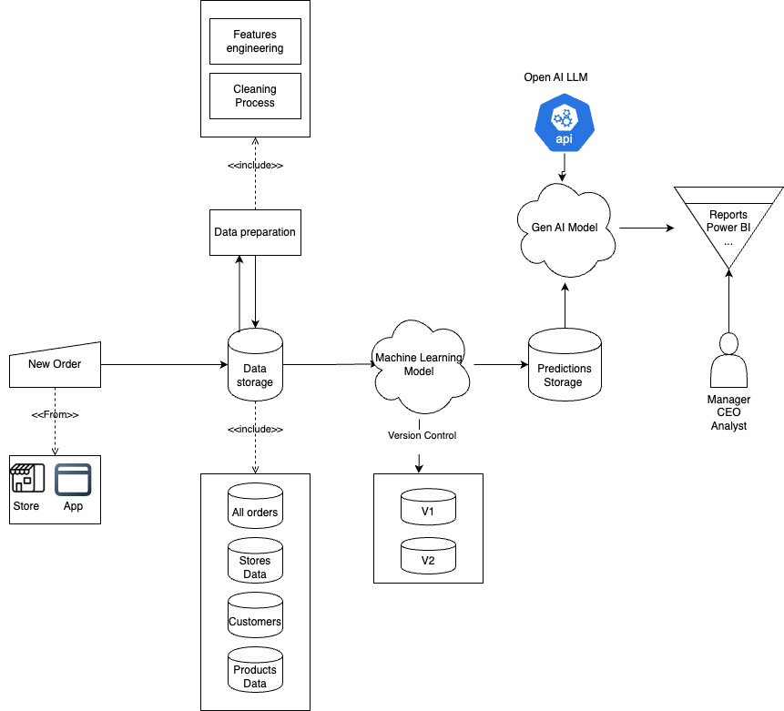

# 📊 Test Technique - Prévision des Ventes 📈  

## 📄 Description du projet  
Ce projet s'inscrit dans le cadre d'un test technique en science des données. L'objectif est de développer une approche de Machine Learning (ML) pour aider les gestionnaires de magasins à prévoir les ventes futures en s'appuyant sur des données historiques.  

## 🛠️ Technologies utilisées  
- **Langage** : Python 🐍  
- **Bibliothèques principales** :  
  - `pandas` pour la manipulation des données  
  - `scikit-learn` pour les modèles ML  
  - `TensorFlow` pour le modèle avancés  
- **Environnement** : Jupyter Notebook 

---

## 📊 1. Préparation des données  

Avant d'entraîner un modèle, il est essentiel de bien comprendre et préparer les données. Voici les principaux constats et ajustements réalisés lors de l'exploration des données :  

### 🔍 **Principaux enseignements de l'exploration des données**  

1. **Segmentation des clients**  
   - Trois segments principaux sont présents : **Consumer, Corporate et Home Office**.  
   - La rentabilité est la plus élevée pour les clients **Corporate**, suivis par **Consumer** et **Home Office**.  

2. **Analyse des catégories de produits**  
   - Les sous-catégories de produits incluent **Bookcases, Chairs, Tables et Furnishings**.  
   - Les **Chairs** sont la sous-catégorie la plus rentable, tandis que les **Tables** affichent des pertes importantes, probablement en raison de **taux de remises élevés**.  

3. **Analyse des ventes et des profits par État**  
   - L'État avec les ventes les plus élevées est **la Californie**, avec un chiffre d’affaires d’environ **156 064,60 $**.  
   - Les ventes et les profits varient fortement d’un État à l’autre, certains affichant même des profits négatifs.  

4. **Modes de livraison**  
   - Quatre modes de livraison sont identifiés : **Second Class, Standard Class, First Class et Same Day**.  
   - **Standard Class** est le mode de livraison le plus utilisé et aussi le plus rentable.  

5. **Tendances mensuelles**  
   - **Décembre** est le mois avec le plus grand nombre de commandes, suivi de **novembre**.  
   - Côté rentabilité, **décembre** est le mois le plus profitable, tandis que **janvier** enregistre des pertes significatives.  

6. **Impact des réductions**  
   - Le taux moyen de remise varie selon les mois, avec un pic en **juin**.  
   - Des remises élevées appliquées sur certaines sous-catégories (ex. **Tables et Bookcases**) contribuent aux pertes.  

7. **Analyse des commandes et des expéditions**  
   - Les données comprennent des informations détaillées sur les dates de commande, d'expédition et les modes de livraison.  
   - L’analyse des délais d’expédition montre que les commandes avec le type `Order_Type` "CA" ont un délai moyen de **3,91 jours**, tandis que celles avec "US" ont un délai moyen de **3,97 jours**.  
   - Cette différence étant minime, il n’y a pas de variation significative entre ces deux types de commandes. Par conséquent, il n'est pas possible de tirer une conclusion claire sur la signification des deux premières lettres du `Order ID` uniquement sur la base du temps de livraison.  

8. **Préparation des données**  
   - Plusieurs colonnes jugées **non essentielles** ont été supprimées afin d’optimiser l'analyse et la performance des modèles, notamment les identifiants des commandes, clients et produits, ainsi que les informations géographiques détaillées.  
   - De plus, les colonnes relatives aux **profits** et aux **quantités vendues** ont également été retirées pour se concentrer sur les variables les plus pertinentes pour la prédiction des ventes.  

---

## 📈 2. Création de nouvelles features (Feature Engineering)  

- Pour enrichir l’analyse et améliorer les performances du modèle, une nouvelle variable a été créée à partir de la date de commande :  
  - **Quarter** : Correspond au trimestre de la commande, extrait de la date sans tenir compte de l’année. Cette feature permet d’analyser les variations saisonnières des ventes.  
- Les colonnes **Order Date** et **Ship Date** ont été supprimées après l’extraction du trimestre, car elles n’étaient plus nécessaires sous leur forme brute.  
- La liste finale des features utilisées pour entraîner le modèle est la suivante :  
  - **Ship Mode** (Mode d'expédition)  
  - **Segment** (Type de client)  
  - **Region** (Région)  
  - **Sub-Category** (Sous-catégorie de produit)  
  - **Sales** (Montant des ventes)  
  - **Discount** (Remise appliquée)  
  - **Quarter** (Trimestre de la commande)  
- Enfin, les données ont été divisées en **ensemble d'entraînement (80%)** et **ensemble de test (20%)** afin d'évaluer les performances du modèle de manière fiable. Les jeux de données finaux ont été sauvegardés pour assurer leur reproductibilité.  

---

## 🤖 3. Approche de Machine Learning  

Deux approches de Machine Learning ont été testées pour prédire les ventes (`Sales`) en fonction des variables sélectionnées après l'encodage des données catégoriques.  

### 🔄 **Préparation des données**  
- Les données d'entraînement et de test ont été transformées en versions encodées (`train_encoded` et `test_encoded`) afin de permettre l'entraînement des modèles.  
- L'encodage des variables catégoriques a été réalisé à l'aide du **One-Hot Encoding**, générant des colonnes binaires pour chaque catégorie.  
- Par exemple, la colonne `Ship Mode` a été transformée en quatre nouvelles colonnes binaires correspondant aux différentes classes (`First Class`, `Same Day`, `Second Class`, `Standard Class`).  

### 🌳 **Modèle 1 : Random Forest Regressor**  
Le premier modèle testé est une **forêt aléatoire (Random Forest Regressor)** issue de la bibliothèque `sklearn.ensemble`.  

#### 📌 **Fonctionnement**  
- Le modèle a été entraîné sur les données encodées (`train_encoded`), avec `Sales` comme variable cible.  
- Il a été évalué sur les données de test (`test_encoded`) en utilisant le **Mean Squared Error (MSE)** et le **coefficient de détermination (R²)**.  

#### 📊 **Résultats**  
- **R-squared (R²) obtenu :** **0.6199**  
  - Cela signifie que **61,99 %** de la variance des ventes peut être expliquée par les variables sélectionnées.  

### 🧠 **Modèle 2 : Réseau de neurones (Neural Network)**  
Un second modèle basé sur un **réseau de neurones artificiel** a été testé en utilisant `TensorFlow` et `Keras`.  

#### 📌 **Architecture du modèle**  
- Une **normalisation des données** a été appliquée en amont.  
- Le modèle est composé de **trois couches cachées** avec **64, 64 et 32 neurones**, et utilise la fonction d'activation **ReLU**.  
- La couche de sortie contient **un seul neurone** pour prédire les ventes.  
- Optimisation réalisée avec l'algorithme **Adam** et fonction de perte **Mean Squared Error**.  

#### 📊 **Résultats**  
- **R-squared (R²) obtenu :** **0.3086**  
  - Ce score est **nettement inférieur** à celui du modèle Random Forest, indiquant que cette approche est **moins performante** sur ce jeu de données.  

### 🏆 **Conclusion**  
- Le modèle **Random Forest Regressor** s'est révélé plus performant que le réseau de neurones pour cette tâche, avec un score R² plus élevé.  
- L’utilisation de **modèles basés sur des arbres de décision** semble plus adaptée aux données tabulaires structurées, tandis que le réseau de neurones aurait nécessité davantage d’optimisation pour obtenir de meilleurs résultats.  

### 📊 **Interprétabilité du modèle avec SHAP**  
Afin de mieux comprendre l'impact de chaque variable sur les prédictions du modèle **Random Forest**, la bibliothèque **SHAP (SHapley Additive exPlanations)** a été utilisée.  

#### 🔍 **Pourquoi utiliser SHAP ?**  
SHAP est une méthode d’explicabilité des modèles de Machine Learning qui permet d’identifier quelles caractéristiques influencent le plus les prédictions. Il attribue un **score d’importance** à chaque variable en mesurant son effet sur la sortie du modèle.  

#### 📊 **Résultats de l’analyse SHAP**  
L’analyse a confirmé que les **deux variables les plus influentes** sur les ventes (`Sales`) sont :  
- **Furnishings** : La sous-catégorie de produit la plus déterminante.  
- **Discount** : L'application de remises a un impact significatif sur les ventes, ce qui corrobore les observations faites précédemment.  

Voici la visualisation des valeurs SHAP illustrant l'importance des différentes variables :  

  

Ces résultats permettent non seulement de mieux interpréter les prédictions du modèle, mais aussi d’orienter les décisions des gestionnaires sur les facteurs clés influençant les ventes.  

---

### 📉 **Dégradation de la performance et gestion de la dérive des données (Data Drift)**  

Lorsque la performance d'un modèle dégradée est observée en production, il est souvent lié à un phénomène appelé **Data Drift**. Le Data Drift désigne un changement dans les propriétés statistiques des données d'entrée. Cela se produit lorsque le modèle rencontre des données qui dévient de celles sur lesquelles il a été initialement formé. Cette évolution des données peut entraîner une diminution des performances du modèle, car il peut avoir du mal à faire des prédictions précises lorsque les données changent continuellement et que le modèle ne peut pas généraliser au-delà de ce qu'il a appris.

**Pourquoi cela se produit-il ?**  
Ce modèle de machine learning est formé sur un ensemble de donnée spécifique, mais ces données peuvent ne plus refléter la réalité du marché ou les conditions actuelles d'aujourd'hui. Par exemple, des événements comme de nouvelles tendances du marché ou des changements dans les préférences des clients peuvent entraîner des écarts entre les données d'entraînement et les données réelles rencontrées en production. Il est crucial de détecter et de traiter cette dérive pour maintenir la fiabilité du modèle dans un environnement dynamique.

#### 🛠️ **Maintenir la performance du modèle avec une mise à jour continue**  
Pour atténuer les effets de la dérive des données, il est essentiel de maintenir le modèle en le réentraînant régulièrement sur de nouvelles données. Cela permet au modèle de rester à jour face aux variations progressives des données, comme l’apparition de nouveaux produits ou l’évolution des comportements des consommateurs. 

Un processus de mise à jour bien défini, incluant une planification régulière de réentraînement et un suivi robuste du modèle, permet de garantir que les performances restent optimales. Ce suivi est crucial pour détecter des problèmes de qualité avant les mises à jour, en intervenant rapidement ou en déclenchant un réentraînement en fonction de la situation.

#### 🔗 **Référence**  
Pour plus de détails sur la dérive des données et comment y faire face, vous pouvez consulter [Evidently AI sur la dérive des données](https://www.evidentlyai.com/ml-in-production/data-drift).

### 🧠 5. **Intégration de l'IA générative**

L'intégration de l'IA générative dans un système de prévision des ventes peut considérablement améliorer l'efficacité des gestionnaires en leur fournissant des rapports périodiques et des insights automatisés. Un exemple concret serait l'utilisation d'un modèle de langage génératif (comme l'API OpenAI) pour générer des rapports détaillant les tendances des ventes, les facteurs influençant la demande, et des recommandations spécifiques pour chaque magasin.

#### 💡 **Architecture proposée et exemple d’utilisation**

L'architecture pourrait être configurée de manière à ce que le modèle d'IA générative accède directement aux données récentes des ventes et aux prévisions produites par le modèle de machine learning. Ensuite, à l'aide de l'API OpenAI ou d'un autre modèle de langage, l'IA pourrait créer un rapport automatisé et personnalisé qui met en lumière les éléments clés pour les gestionnaires de magasins.

Cela pourrait inclure des éléments tels que :

- Les meilleures ventes du mois ou de la semaine.
- Les produits à surveiller en raison d'une baisse des ventes ou d'une forte demande.
- Recommandations d'actions basées sur les tendances et les anomalies observées.
  
En outre, voici quelques autres applications de l'IA générative dans ce contexte :
  
- **Prévisions dynamiques basées sur des événements externes** : L'IA générative pourrait également intégrer des événements externes (comme des tendances économiques ou des campagnes publicitaires ou COVID) et générer des prévisions de ventes ajustées en temps réel.

Voici un schéma représentant l'architecture de ce système d'IA générative intégré dans un workflow de prévision des ventes :

Avec cette solution, les gestionnaires bénéficieraient non seulement de prévisions précises, mais aussi de rapports contextuels rédigés automatiquement, leur permettant de prendre des décisions éclairées sans avoir à analyser manuellement les données.

---

### 📌 **Remarques finales**  
- Tous les fichiers de code développés sont disponibles dans ce **repo GitHub**.
- Ce travail m’a pris entre **4 et 5 heures** à réaliser.
- J’ai utilisé **ChatGPT** et **GitHub Copilot** pour m'aider à générer rapidement du texte et du code.
- Tous les sujets abordés ici sont mes propres idées et réflexions.
